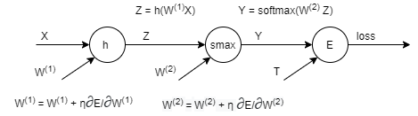

# First Machine Learning Assignment 
@ AUEB 2021 <br>
***
Commands:
```console
python main.py DATASET_NAME
```
- DATASET_NAME: mnist or cifar
***
Architecture:  <br>

***
Results: <br>
| Dataset      | best hyperparameters | accuracy |
| ----------- | ----------- | ----------- |
| mnist      | lr = 1e-04, λ = 1e-05, Μ = 100, H3Activation, glorot | 0.9607 |
| cifar   | lr = 1e-04, λ = 1e-05, Μ = 300, H3Activation, glorot | 0.5292 |
